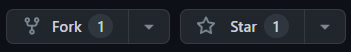

Welcome to the Portfolio Website Template! This open-source repository, authored by Jane Smith, provides a versatile and customizable foundation for creating your personal or professional portfolio website. Whether you are a designer, developer, artist, or any creative professional, this template aims to showcase your work and skills in a visually appealing manner.

 

Author: [preetsuthar](https://preetsuthar.me) | [github](https://github.com/preetsuthar17)
 

 

<video src="./20230729-1356-59.8093197.mp4" controls="controls" style="max-width: 730px;">
</video>

 

Key Features:
--------------------------------

🎨 **Stunning Visuals**: Create an impressive portfolio with beautiful and responsive design elements.

📝 **Project Showcasing**: Highlight your projects, artwork, or code samples in an organized and captivating manner.

💼 **About Me Section**: Introduce yourself to visitors through a well-crafted "About Me" section.

📱 **Mobile Responsiveness**: Ensure your portfolio looks great on various devices and screen sizes.

🔍 **SEO-friendly**: Implement best practices to make your portfolio website search engine friendly.

💌 **Contact Form**: Enable a contact form for potential clients or collaborators to reach out to you.

🚀 **Optimized Performance**: Utilize modern web techniques to ensure fast-loading pages.

Contributing:
--------------------------------

We value the power of community collaboration and encourage developers of all levels to contribute. To contribute to the Portfolio Website Template:

1. Fork the repository.
2. Create a new branch from `main`.
3. Implement your enhancements and improvements.
4. Commit your changes with clear descriptions.
5. Push changes to your fork.
6. Open a pull request (PR) to the main repository.

Getting Started:
--------------------------------

To set up the Portfolio Website Template:

1. Clone the repository to your local machine.
2. Install necessary dependencies using npm or yarn.
3. Customize the template with your own content, projects, and details.
4. Personalize the design and layout to match your style.
5. Test your website locally before deployment.

Deployment:
--------------------------------

There are various options to deploy your portfolio website, including:

🌐 **GitHub Pages**: Easily host your website using GitHub Pages, a free and straightforward hosting service.

🚀 **Netlify**: Benefit from continuous deployment and other advanced features offered by Netlify.

🔧 **Custom Server**: Host your website on your preferred web hosting provider or your own server.

License:
--------------------------------

This project is licensed under the MIT License, granting you the freedom to use, modify, and distribute the code.

Start showcasing your creativity and achievements with the Portfolio Website Template! 🎉

---

Note: The above description is a fictional representation of a generic portfolio website template repository. To find actual open-source portfolio website templates, explore GitHub and search for repositories using relevant keywords like "portfolio website template" or "portfolio starter." Always review the license and contribution guidelines of the repository you choose to use or contribute to.